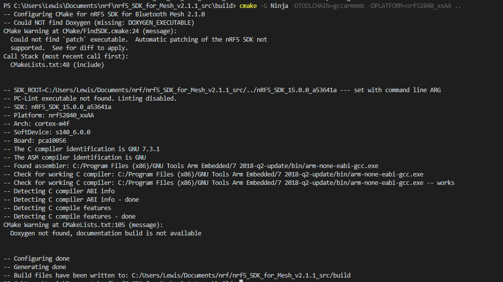
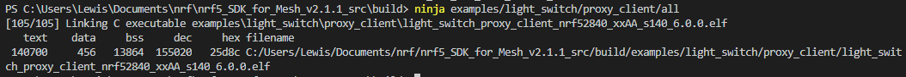
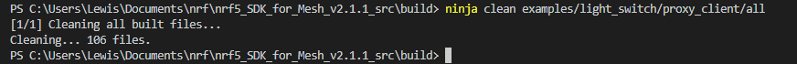
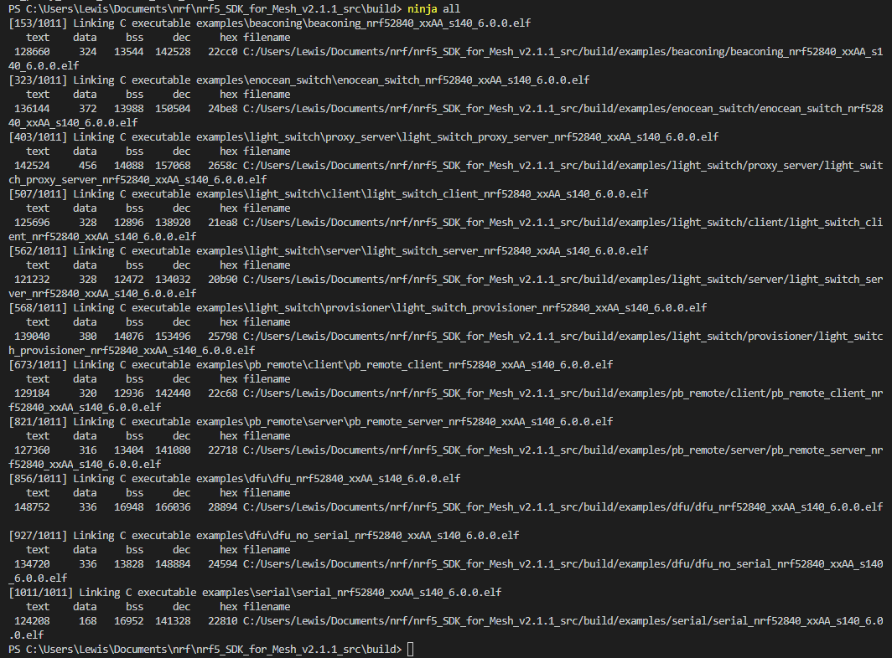
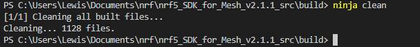
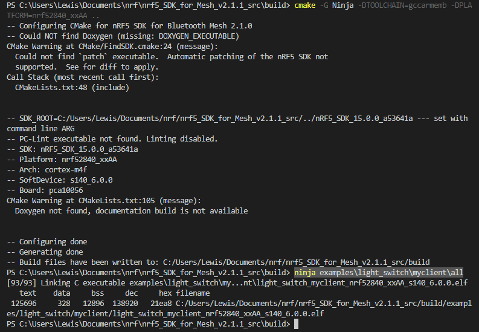
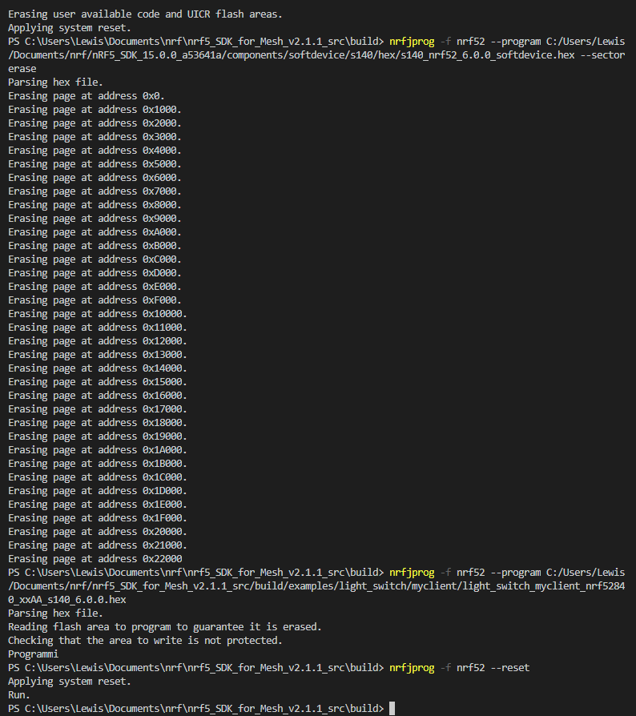
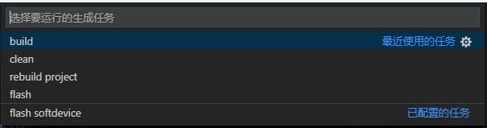

# GNU ARM Embedded Tolchain
1. 下载[GNU ARM Embedded Tolchain](https://developer.arm.com/open-source/gnu-toolchain/gnu-rm/downloads#)

2. 根据所使用的系统选择安装方式:
* mac/liunx 上可以把tar包解压到自己指定的目录内，然后在`~/.bash_proflie`内添加路径声明

* windonws上下载`exe`文件直接双击进行安装 ,安装完毕后记得勾选"Add path to environmet variable",如果没有这个option，那就自己手动添加到环境变量内即可


# nRF5x-Command-Line-Tools

下载安装[nRF5x-Command-Line-Tools](https://www.nordicsemi.com/eng/Products/nRF52840)

CommandLineTools安装完毕后不会自动添加在环境变量内，需要手动添加到环境变量内:

## Windows
默认安装目录为，
```
C:\Program Files (x86)\Nordic Semiconductor\nrf5x\bin
```
将该路径添加在环境变量内，以便可以在命令行直接调用,Windows 更改环境变量后不会马上生效，需要重启才能生效。

## Mac/Liunx
添加到环境变量与安装gcc编译工具链方式相同


nRF5x-Command-Line-Tools内包含两个工具:
* `mergehex` 多hex文件合并工具
* `nrfjprog` 烧录nrf soc工具


# nRF5_SDK Configure
根据使用平台修改以下文件:

Mac/Liunx:
```
nRF5_SDK_15.0.0_a53641a/components/toolchain/gcc/Makefile.posix
```
Windows:
```
nRF5_SDK_15.0.0_a53641a/components/toolchain/gcc/Makefile.windows
```

只需要更改`GNU_INSTALL_ROOT`这行即可，将这行替换为你安装gcc的路径即可,版本改不改都行
```
GNU_INSTALL_ROOT := C:/Program Files (x86)/GNU Tools ARM Embedded/6 2017-q2-update/bin/
GNU_VERSION := 6.3.1
GNU_PREFIX := arm-none-eabi
```

# MeshSDK Configure

1. 安装[cmake 构建工具](https://cmake.org/download/)
    ### Windows
    * 安装时候勾选`Add CMake to the system PATH for all users` 或者 `current user`

    ### Mac
    * 下载`dmg`包安装之后，需要打开终端,输入命令进行安装到命令行
        ```
        sudo "/Applications/CMake.app/Contents/bin/cmake-gui" --install
        ```
    ### Liunx
    * liunx下采用deb安装方式，直接双击安装


2. 安装[Ninja 构建工具](https://github.com/ninja-build/ninja/releases)
     ### Windows
        下载zip包，解压到自己指定的目录，这里我把它放在`nRF5x-Command-Line`安装路径中，这样不需要配置环境变量了，因为之前已经被配置了

    ### Mac
    * 安装[xcode](https://developer.apple.com/xcode/)
    * 安装`xcode-command-line-tools`
        ```
        xcode-select --install
        ```
    * 安装`homebrew`
        ```
        ruby -e "$(curl -fsSL https://raw.githubusercontent.com/Homebrew/install/master/install)" < /dev/null 2> /dev/null
        ```
    * 安装`Ninja`
        ```
        brew install ninja
        ```

2. 下载[Python3](https://www.python.org/)
    ### Windows
        安装后记得勾选添加到环境变量内

    ### Mac
    ```
    brew install python
    ```
    ### Liunx
        系统自带,不需要安装


        
3. 下载[nRF5_SDK](https://www.nordicsemi.com/eng/nordic/Products/nRF5-SDK/nRF5-SDK-zip/59011)
4. 下载[nRF_Mesh_SDK](https://www.nordicsemi.com/eng/nordic/Products/nRF5-SDK-for-Mesh/nRF5-SDK-for-Mesh/62377)
5. 将`nRF5_SDK`和`nRF_Mesh_SDK`解压,放置在同级目录下
5. 下面进行对mesh工程进行构建
    ```
    1. cd nrf5_SDK_for_Mesh_v2.1.1_src
    2. mkdir build
    3. cmake -G Ninja -DTOOLCHAIN=gccarmemb -DPLATFORM=nrf52840_xxAA ..
    ```

    第三步`TOOLCHAIN`和`PLATFORM`根据自身的情况选择,支持下表几种选择

    |TOOLCHAIN|PLATFORM|
    |-------|----------|
    |[gccarmemb](https://developer.arm.com/open-source/gnu-toolchain/gnu-rm)|<del>nrf51422_xxAC</del>|
    |[armcc](https://developer.arm.com/products/software-development-tools/compilers/arm-compiler/downloads/version-5)|nrf52832_xxAA|
    |[clang](https://clang.llvm.org/)|nrf52840_xxAA|


    运行无误显示如下图:

    

    如果工程SDK工程结构没有变更，这里指的变更是没有添加的工程，那么只需要构建一次即可，如果添加了自己的工程需要重新构建cmakelist，重新运行上面第三行重新构建即可

6. 对工程进行编译
    这里不管对哪个工程进行进行编译都需要在`build`这个目录内运行`ninja`这个命令，因为`cmake`已经对该sdk进行构建了索引,在`build`目录内运行`powershell`,这里我以`light_switch`这个工程为例子

    * 指定工程进行编译
        ```
        ninja examples/light_switch/proxy_client/all
        ```
        运行效果如下图:

        

    * 清除指定工程
        ```
        ninja clean examples/light_switch/proxy_client/all
        ```
        运行效果如下图:

        


    * 对构建的所有工程进行编译
        ```
        ninja all
        ```
        运行效果如下图:

        

    * 清除所有编译工程
        ```
        ninja clean
        ```
        运行效果如下图:

        


7. 添加属于自己的工程

    最简单的方法就是直接拷贝现有的工程，还是以`light_switch`这个examples为例子，cp `light_switch/client` 为 `light_switch/myclient`
    在`light_switch`顶层`CMakeLists.txt`文件中添加子目录

    ```
    add_subdirectory("myclient")
    ```
    在`myclient`目录内`CMakeLists.txt`内更改target名为`light_switch_myclient_${PLATFORM}_${SOFTDEVICE}`

    然后在`mesh_sdk/build`目录下输入重构工程命令
    ```
    cmake -G Ninja -DTOOLCHAIN=gccarmemb -DPLATFORM=nrf52840_xxAA ..
    ```
    再次运行编译命令
    ```
    ninja examples\light_switch\myclient\all
    ```
    这样就完成了新建一个自己的工程了，需要添加文件只需要对该工程下修改`CMakeLists.txt`既可
    
    运行效果如下图:

    

8. 烧录hex文件
    烧录hex文件需要安装[nRF5x-Command-Line-Tools](https://www.nordicsemi.com/eng/Products/nRF52840)，需要使用到里面提供的`nrfjprog`

    * 连接你的板子
    * 这里烧录`myclient` 这个工程,使用如下命令进行烧录
    ```
    # 烧录前清除flash，这个不是必须的
    nrfjprog -f nrf52 --eraseall

    # 烧录softdevice,这里需要使用绝对路径，不可以使用相对路径
    nrfjprog -f nrf52 --program C:/Users/Lewis/Documents/nrf/nRF5_SDK_15.0.0_a53641a/components/softdevice/s140/hex/s140_nrf52_6.0.0_softdevice.hex --sectorerase

    # 烧录指定的hex文件,这里需要使用绝对路径，不可以使用相对路径
    nrfjprog -f nrf52 --program C:/Users/Lewis/Documents/nrf/nrf5_SDK_for_Mesh_v2.1.1_src/build/examples/light_switch/myclient/light_switch_myclient_nrf52840_xxAA_s140_6.0.0.hex

    # 复位
	nrfjprog -f nrf52 --reset
    ```
    运行效果如下图:

    

    如果每次编译烧录都要输入那么一大堆命令还不如使用ide算了，所以需要自己写一个脚本再配合`vscode`任务就可以像ide那样工作了，原来写了一个shell脚本，后来考虑到跨平台的问题，所以使用python重写了一个脚本,脚本名为`run.py`

    使用方法:
    * 将`run.py` 放在与Mesh_SDK和nRF5_SDK同级目录下
    * 可以使用如下命令进行对sdk的构建,编译,清除,烧录,mac/liunx无需带`python.exe`,请注意路径符

        ```
        # 编译指定工程
        python.exe .\run.py build  examples\light_switch\myclient
        # 清除指定工程编译文件
        python.exe .\run.py clean  examples\light_switch\myclient
        # 烧写指定工程hex
        python.exe .\run.py flash  examples\light_switch\myclient
        # 构建工程(cmake 的那一步)
        python.exe .\run.py rebuild  
        # 写入softdevice
        python.exe .\run.py flash_softdevice  
        ```
    * 默认指定构建编译器为`gccarmemb`,平台为`nrf52840_xxAA`,如需更改请自行在`run.py`内更改
    

9. 配置vscode task任务
    * 使用模板生成`task.json`，哪个模板都可以，模板内容请参照tasks.json文件
    * 使用Ctr+Shift+B 快捷键运行当前任务，可以看到已经配置的任务

        


